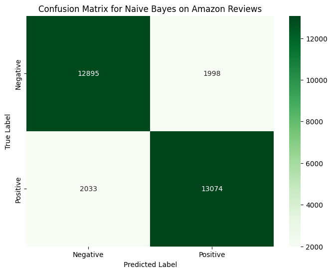

[](https://www.python.org/)[](https://pytorch.org/)[](LICENSE)

# 🛍️ ReviewSense: Product Review Analysis Engine

> *ReviewSense is a comprehensive, end-to-end Natural Language Processing application built to extract deep, actionable insights from unstructured product reviews.*  
Where a simple star rating only tells part of the story, ReviewSense dives into the text to uncover what customers are saying, why they're saying it, and how they feel about specific product features.  

This project demonstrates a complete **MLOps workflow**, from initial data preparation and model fine-tuning to the development and deployment of a multi-model, interactive web application with Gradio.


You can find the Gradio app [Here](https://huggingface.co/spaces/Deathshot78/ReviewSense)

---

## 📋 Table of Contents

- [📖 Overview](#-overview)  
- [✨ Key Features](#-key-features)
- [📈 Model Development and Benchmarking](#-model-development-and-benchmarking)
- [🧠 How It Works: The Analysis Pipeline](#-how-it-works-the-analysis-pipeline)
- [🔮 Future Improvements](#-future-improvements)
- [⚙️ Setup and Installation](#️-setup-and-installation)  
- [▶️ Usage](#️-usage)  
- [📁 Project Structure](#-project-structure)  
- [🛠️ Technologies and Models](#️-technologies-and-models)  

---

## 📖 Overview

In the world of e-commerce, customer reviews are a **goldmine of information**. However, manually reading through thousands of reviews is impossible.  

This project solves that problem by creating an automated system that performs a **multi-layered analysis** on any given product review, providing a structured output that is far more valuable than a simple positive/negative label.

The application is built to be **modular** and showcases the power of combining a custom fine-tuned model with several pre-trained transformers, each specialized for a specific task.

---

## ✨ Key Features

- 📈 **Overall Sentiment Analysis**  
  Classifies reviews as **POSITIVE** or **NEGATIVE**, powered by a fine-tuned DistilBERT model on the Amazon Reviews dataset.

- 🔎 **Dynamic Aspect Extraction**  
  Automatically identifies product features (e.g., *camera, battery life, plot*) using POS tagging combined with category-specific dictionaries.

- 📊 **Aspect-Based Sentiment Analysis (ABSA)**  
  Determines specific sentiment (*Positive, Negative, Neutral*) for each aspect, e.g., *“loved the camera, disappointed with the battery life.”*

- 📝 **Abstractive Summarization**  
  Generates concise summaries of reviews using a pre-trained DistilBART model.

- 🚀 **Interactive UI**  
  A clean, user-friendly **Gradio interface** for real-time review analysis.

---

## 📈 Model Development and Benchmarking

A key part of this project was to not just build a model, but to prove its effectiveness. To do this, we followed a standard machine learning practice of establishing a strong baseline before moving to a more complex architecture.

**1. The Baseline Model**
We first trained a classic `Multinomial Naive Bayes` model. The text was vectorized using `TF-IDF`, and we performed a hyperparameter grid search to find the optimal settings. This approach is fast, interpretable, and provides a strong benchmark for text classification.



- **Baseline Accuracy: 86.56%**

**1. The Fine-Tuned Transformer**
Next, we fine-tuned a `DistilBERT` model, a smaller and more efficient variant of BERT. By leveraging its pre-trained understanding of the English language and fine-tuning it on our specific Amazon reviews data, we aimed to capture more of the nuance and context that the baseline model might miss.


- **Fine-Tuned Accuracy: ~95%**


**Conclusion**

The significant increase in accuracy from **86.6%** to **~95%** demonstrates the power of transfer learning and the superior contextual understanding of transformer models. This performance gain justified the selection of the more computationally intensive DistilBERT model for the final application.

---

## 🧠 How It Works: The Analysis Pipeline

When a user submits a review, the application processes it through these steps:

1. **Category Selection** → User selects product type (*Phone, Book, etc.*).  
2. **Aspect Extraction** → Extracts nouns via POS tagging and filters with category dictionary.  
3. **Aspect Sentiment Analysis** → DeBERTa-based ABSA model assigns sentiment per aspect.  
4. **Overall Sentiment Classification** → DistilBERT model predicts POSITIVE/NEGATIVE.  
5. **Summarization** → DistilBART generates a short summary.  
6. **Display** → Results presented in the Gradio UI.

---

## 🔮 Future Improvements

- 📂 **Batch Processing Mode** → Upload CSV, get analyzed CSV output.

- 📚 **Expand Aspect Dictionaries for more product categories.**

- 🤖 **Advanced Aspect Extraction** → Replace POS heuristics with ATE models for discovering new aspects automatically.
- 💹 **Train the sentiment reviewer for longer and on more of the data for better performance.**

---

## ⚙️ Setup and Installation

### 1. Clone the Repository

```bash
git clone https://github.com/Deathshot78/ReviewSense.git
cd ReviewSense
```

### 2. Install Required Packages

```bash
pip install -r requirements.txt
```

### 3. Download Dataset

Download Amazon Reviews for Sentiment Analysis from [Kaggle](https://www.kaggle.com/datasets/kritanjalijain/amazon-reviews).

Place `train.csv` and `test.csv` into the `data/` directory.

### 4. Preprocess Data

```bash
python data_prepare.py
```

### 5. Fine-Tune Sentiment Model

```bash
python python train.py
```

---

## ▶️ Usage

Run the main script:

```bash
python python main.py
```

---

## 📁 Project Structure

```bash
├── 📄 README.md               # Project documentation
├── 🐍 app.py                  # Gradio app (UI + logic)
├── 🐍 models.py               # Model definitions & inference classes
├── 🐍 train.py                # Fine-tune sentiment classifier
├── 🐍 data_prepare.py         # Data preprocessing script
├── 🐍 app.py                  # Gradio app
├── 📄 requirements.txt        # Dependencies
├── 📁 data/                   # Datasets (local only)
└── 📁 checkpoints/            # Saved model checkpoints
```

---

## 🛠️ Technologies and Models

**Core Technologies**

- Python, PyTorch, PyTorch Lightning

- Gradio (UI)

- Pandas, Scikit-learn

- NLP Models (Hugging Face)

- Sentiment Classifier: distilbert-base-uncased (fine-tuned)

- Review Summarizer: sshleifer/distilbart-cnn-6-6

- Aspect Extractor: vblagoje/bert-english-uncased-finetuned-pos

- Aspect Analyzer: yangheng/deberta-v3-base-absa-v1.1
